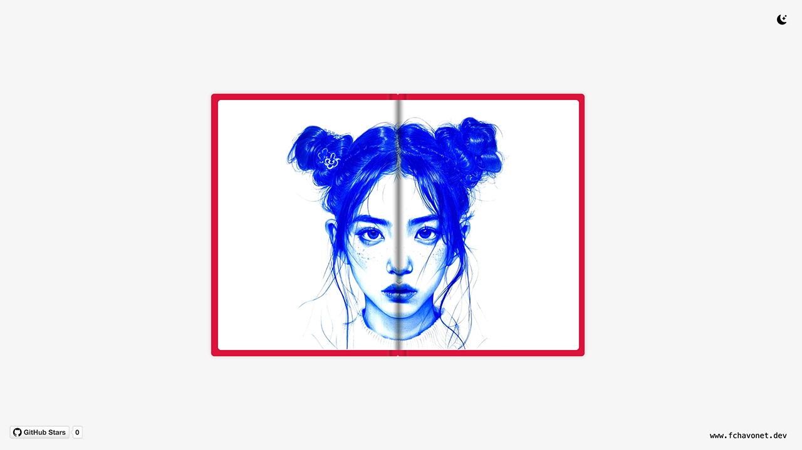

# Flip Book

## Description

This project is a flip book created with HTML and CSS.

The design mimics the real-life experience of flipping through the pages of a book. Using CSS for page animations and transitions, the flip book provides a smooth experience for the user, making it both functional and aesthetically pleasing.

## Objectives

- All pages should flip smoothly using CSS animations.
- The project must be built using only HTML and CSS (initially, before adding JavaScript features).
- Improve CSS animation skills by creating realistic page effects.
- Provide clear and concise documentation for the code.

## Tech Stack


## File Description

| **FILE**     | **DESCRIPTION**                                     |
| :----------: | --------------------------------------------------- |
| `assets`     | Contains the resources required for the repository. |
| `index.html` | Main HTML structure for the project.                |
| `style.css`  | Styles and animations for the project.              |
| `script.js`  | Behavior script for interactivity.                  |
| `README.md`  | The README file you are currently reading 😉.       |

## Installation & Usage

### Installation

1. Clone this repository:
    - Open your preferred Terminal.
    - Navigate to the directory where you want to clone the repository.
    - Run the following command:

```
git clone https://github.com/fchavonet/creative_coding-flip_book.git
```

2. Open the cloned repository.

### Usage

1. Open the `index.html` file in your web browser.

2. Interact with the flip book by clicking on the cover or the pages.

You can also test the project online by clicking [here](https://fchavonet.github.io/creative_coding-flip_book/).

<p align="center">
    <picture>
        <source media="(prefers-color-scheme: dark)" srcset="./assets/images/screenshots/desktop_page_screenshot-dark.webp">
        <source media="(prefers-color-scheme: light)" srcset="./assets/images/screenshots/desktop_page_screenshot-light.webp">
        
    </picture>
</p>

## What's Next?

- Implement dynamic content loading per page using JavaScript.
- Add a function to dynamically create pages based on a variable (number of pages).
- Integrate a color selector for the flipbook cover.

## Thanks

- A big thank you to my friends Pierre and Yoann, always available to test and provide feedback on my projects.

## Author(s)

**Fabien CHAVONET**
- GitHub: [@fchavonet](https://github.com/fchavonet)
